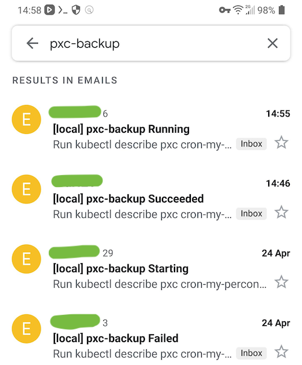

# percona-backup-notification

This is a simple Kubernetes controller to monitor backup progress for [Percona XtraDB Kubernetes operator](https://github.com/percona/percona-xtradb-cluster-operator). This tool notifies by email when there are changes in backup object called `pxc-backup`.

In the email's body, you will see exact backup object name. So you know which backup is progressing well or failing.

If your mail client classifies emails by subject in groups, you mailbox will not look bombed by emails (only counts are increasing):



The pod (controller) is started in Percona DB namespace and monitors backups which are usually listed with command `kubectl get pxc-backup -n <namespace>`, but this tool does it at Kubernetes apiserver level by watching a backup object. So it doesn't call apiserver every few seconds, it watches for changes.

## Installation

Clone repo, make sure you have `helm` and `kubectl` installed and it points to your target cluster where Percona DB backups are scheduled:

```bash
helm install ./helm \
  --generate-name \
  --namespace percona-l \
  --set percona_namespace=percona-l \
  --set service_account=percona-backup-notification-sa \
  --set secret_name=percona-backup-notification-secrets \
  --set email.enabled=true \
  --set email.smtp.host=smtp.gmail.com \
  --set email.smtp.port=587 \
  --set email.smtp.username=your-username-95712363910@gmail.com \
  --set email.smtp.password=your-password \
  --set email.from_address=your-email-from-95712363910@gmail.com \
  --set email.to_address=your-email-to-95712363910@gmail.com \
  --set email.subject_prefix="[development]" \
  --set email.from_sender_name="Company X"
```

That's it

## Uninstall

Delete these resources

```
kubectl get deploy -n percona-l | grep percona-backup-notification
kubectl get clusterrolebinding | grep percona-backup-notification
kubectl get clusterrole | grep percona-backup-notification
kubectl get sa -n percona-l | grep percona-backup-notification-sa
kubectl get secret -n percona-l | grep percona-backup-notification

```

## Development only

Building Docker container

```
cd percona-backup-notification
docker login --username=laimison
docker build -t percona-backup-notification .
docker images | head
docker tag taghere laimison/percona-backup-notification:latest
docker push laimison/percona-backup-notification:latest

docker tag taghere laimison/percona-backup-notification:0.1
docker push laimison/percona-backup-notification:0.1
```

You can access the pod and check what is returned by Kuberntes apiserver

```
curl -v --cacert /var/run/secrets/kubernetes.io/serviceaccount/ca.crt -H "Authorization: Bearer $(cat /var/run/secrets/kubernetes.io/serviceaccount/token)" https://kubernetes.default.svc/apis/pxc.percona.com/v1/perconaxtradbclusterbackups | jq .
```

## Thanks

Special thanks to https://github.com/vitobotta for the code, that was adapted by myself for Percona and used in this controller
